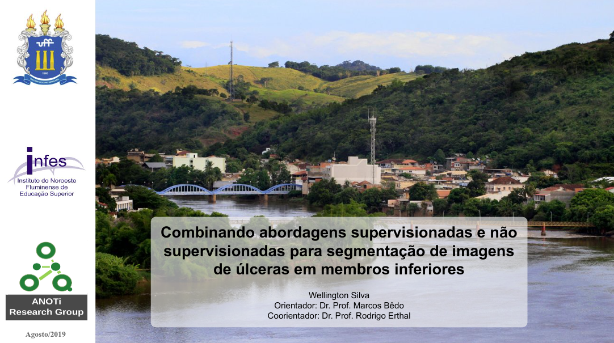
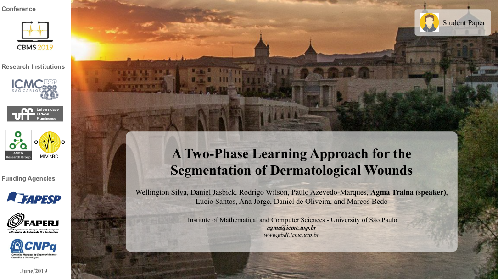
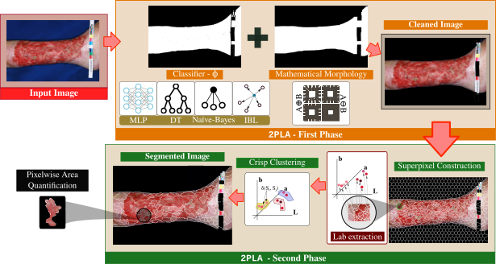

# Trabalho Final do Curso de Computação :mortar_board:

## [Monografia :memo:](https://github.com/sswellington/trabalho-final-de-curso/blob/main/docs/monografia-min.pdf) | [Apresentação :man_teacher:](https://github.com/sswellington/trabalho-final-de-curso/blob/main/docs/apresentation.pdf)

	

---
## [Apresentação :man_teacher:](https://github.com/sswellington/trabalho-final-de-curso/blob/main/docs/CBMS2019-2PLA.pdf) | [DOI:10.1109/CBMS.2019.00076](https://ieeexplore.ieee.org/document/8787493/) :notebook_with_decorative_cover: | [Código Fonte](https://github.com/sswellington/2PLA) :man_technologist:

	

---

## Resumo 

Elaboração de sistemas de diagnóstico assistido por computador denominado 2PLA para a
segmentação de tecidos em fotografias de úlceras crônicas em membros inferiores. 
Então, abordagem não intrusiva para análises dermatológicas. 

Este projeto envolveu a concepção e implementação de técnicas de aprendizagem de máquina junto ao processamento digital de imagens aplicadas as imagens de úlceras em membros inferiores, visando identificar e segmentar diferentes classes de tecidos em feridas dermatológicas.

	

### Técnicas e Requisitos
* Desenvolvimento em C/C++ e OpenCV; e MATLAB
* Aprendizagem de Máquina e Visão Computacional / Processamento de imagem
* Matlab R2018b.
* 350 MB de mémoria primária.
* 4 GB de mémoria secundária.
* Intel i3 2th generation core processor.

---

### Notícia
* Aluno Wellington de Souza Silva (Curso de Computação) INFES/UFF e pesquisadores do Grupo ANOTi têm trabalho reconhecido em conferência internacional.[ (UFF-INFES :link:)](http://infes.uff.br/aluno-do-infes-uff-e-pesquisadores-do-grupo-anoti-tem-trabalho-reconhecido-em-conferencia-internacional-aluno-wellington-de-souza-silva-do-curso-de-computacao-do-infes-uff-foi-premiado-como-finalist/)
* A Two-Phase Learning Approach for the Segmentation of Dermatological Wounds[ (Computer :link:)](https://www.computer.org/csdl/proceedings-article/cbms/2019/228600a343/1cdO0qLxGvK)
* Artigos de pesquisadores do ICMC-USP são premiados em conferência internacional[ (ICMC-USP :link:)](https://agencia.fapesp.br/artigos-de-pesquisadores-do-icmc-usp-sao-premiados-em-conferencia-internacional/31134/)
* Computação e medicina: artigos do ICMC são premiados em conferência internacional[ (USP-ICMC :link:)](https://icmc.usp.br/noticias/4404-computacao-e-medicina-artigos-do-icmc-sao-premiados-em-conferencia-internacional)
* Professor do IFNMG é um dos autores de estudo premiado em uma das principais conferências na área de computação, medicina e bioinformática[ (IFNMG :link:)](https://www.ifnmg.edu.br/mais-noticias-portal/492-portal-noticias-2019/21351-professor-do-ifnmg-e-um-dos-autores-de-estudo-premiado-em-uma-das-principais-conferencias-na-area-de-computacao-medicina-e-bioinformatica)
